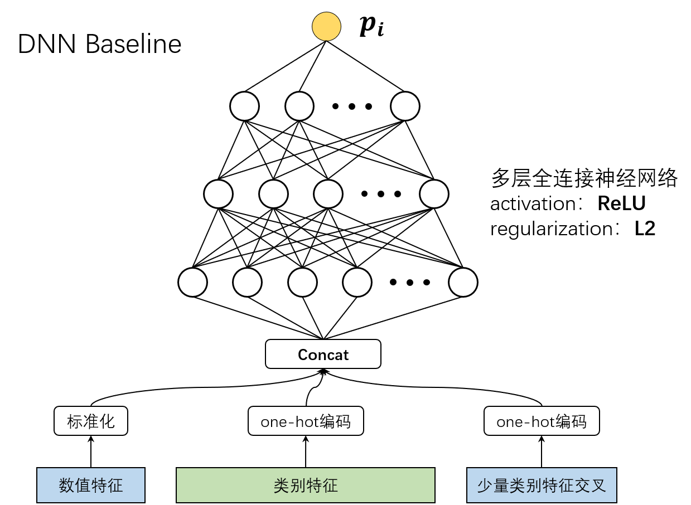
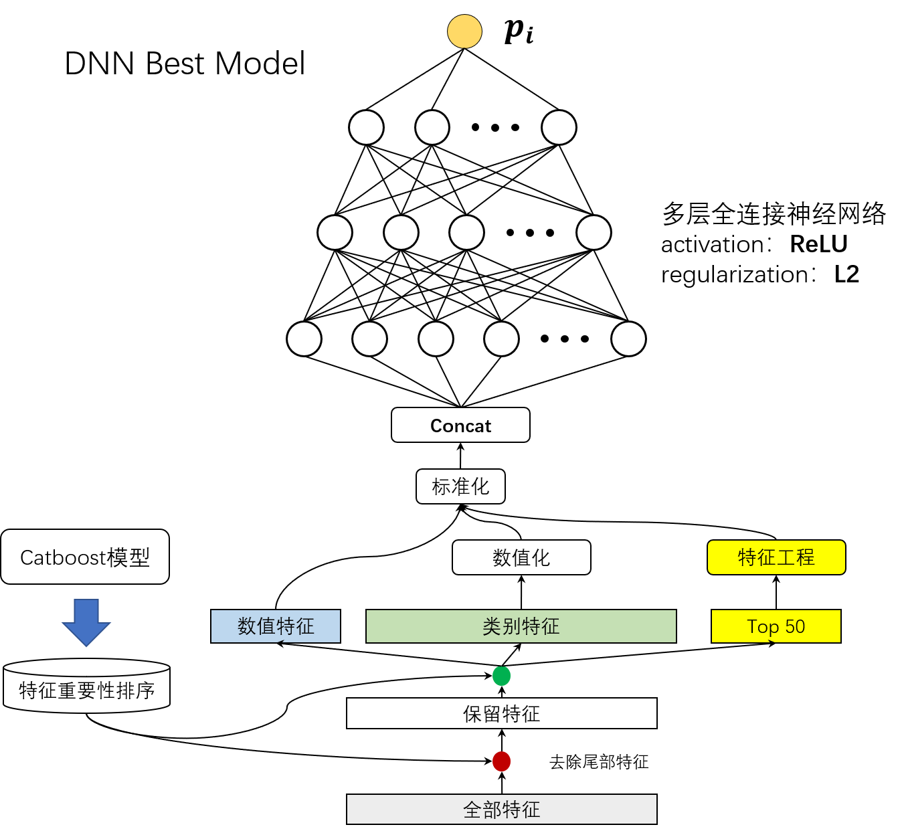
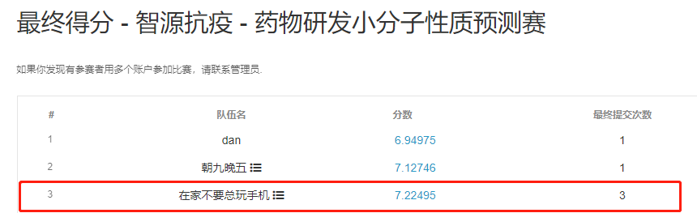

# Biendata_Molecule_Prediction_Challenge_3rd
智源抗疫 - 药物研发小分子性质预测赛 复赛第3名(3rd) DNN代码

[TOC]

## 1. 背景

药物研发是一项成本极高的工作。著名的医学期刊JAMA的一篇调查论文显示，研发一款癌症药物的成本在6.48亿美元左右。其中，大量成本都会用于待选药物分子的测试实验上。虚拟筛选等计算技术可以缩小筛选对象集，降低制药成本，而机器学习技术的出现极大地辅助了计算机辅助药物设计的进步。因此，化学信息学或药物研发领域开始使用各种机器学习技术。本次竞赛就是提供小分子的一些特征和6种性质标签，寻求一种高性能的机器学习模型，拟合分子特征到分子性质的回归映射。

根据分子结构信息预测分子可能的化学性质，将在化学研究和制药领域产生重要应用。目前，大部分潜在药物都是小分子，如果能根据结构提前预测小分子的性质，将减少药物的研发成本。

本次比赛的任务是根据从小分子结构中提取的3177维度特征，预测小分子的以下六个化学性质：
’Dipole Moment’
’HOMO energy’
’LUMO energy’
’zero-point vibrational energy’
’atomization energy at zero kelvin’
‘atomization energy at room temperature’
这六个性质的准确预测对于药物的发现和开发将提供重要价值。

比赛链接：https://www.biendata.xyz/competition/molecule/

## 2. 技术方案

### 2.1 基于DNN的方法

#### 2.1.1 baseline

本赛题可以看做多个目标的回归问题，可以简单地将每个目标独立建模，也就是建模p1~p6这6个回归任务。由此可以自然地想到利用多层全连接神经网络，即DNN进行处理。考虑到特征数据包括一小部分数值型特征（numerical features）和大部分类别型特征（categorical features，注：二值特征，多值特征等都归为类别特征组成），而DNN模型不能直接处理类别型特征，所以我们将类别型特征都进行one-hot编码，将数值型特征标准化，得到DNN模型的输入。DNN的baseline模型如下图所示。

如图所示，在baseline模型中，我们采用了5层的DNN神经网络，网络输出的logits即为目标预测值，激活函数为ReLU，为了缓解过拟合问题，使用了L2正则化（注：不能使用Dropout等方法，随机性会影响最终的输出logits，由于是回归问题，logits的客观值十分重要，一点小误差可能导致分数很差）。

输入特征除了基本的数值特征与类别特征之外，还加入了少量类别特征交叉得来的新特征，基本是选择由catboost模型训练完得到的特征重要性top的类别特征做交叉，得到的交叉特征也使用one-hot编码。

为了保证训练数据与未来测试数据的特征一致性，一开始我们对训练数据进行80%的采样处理，使用采样数据计算特征的均值、方差、类别数等，然后再进行标准化或编码，这样做的好处是可以使模型训练阶段与推理阶段保持一致，随机采样也提高了鲁棒性。

#### 2.1.2 最终单模型

DNN baseline模型虽然也跑出了不错的结果，但是也存在着很多问题，主要如下：

a) one-hot编码后，输入数据过于稀疏且维度过大，导致模型参数量剧增（因为一层神经网络权重参数量是输入维度*输出维度），训练缓慢，且影响精度。

b) 虽然神经网络模型可以自动学习数据中的一些高阶非线性信息，但是充分的特征工程仍是必要的。

为了解决上述问题，我们全面抛弃了one-hot编码的模式，将全部特征数值化，对于二值特征，全部重新赋值为1.与-1.。对于多值特征，也全部进行均值方差标准化，注意，这里的均值方差标准化与数值型特征的不同，并不是用全部数据统计均值，而是用的特征取值集合的均值与方差，这样可以使特征值的分布更加均匀。

此外，加入了更多的特征工程，全部的特征工程都是根据catboost模型[2]训练得到的特征重要性排序而处理。首先，删除特征重要性排序后1500的特征，然后，取特征重要性排序前50的重要特征进行特征工程，包括，类别特征交叉，数值特征分桶（为维护简单，全部按10个区间分桶），分桶特征与类别特征交叉，分桶特征之间交叉（代替数值特征的交互）等。最优DNN单模型如下图所示。

最佳单模型的模型设置与超参设置上与baseline相同，因为输入维度大幅度降低，所以整体的参数量也大幅度降低为baseline的近1/6，模型训练更快收敛，效果更好。另外还需要注意的是，baseline模型对各个目标建模都使用同一套特征，而最佳单模型的特征处理上，根据每个目标的重要特征不同，每个目标建模维护一套特征。

### 2.2 基于树模型的方法

传送门：[在家不要总玩手机 小分子性质预测 第三名 总结](https://www.biendata.xyz/models/category/5576/)

## 3. 代码使用

### 3.1 环境

| 依赖           | 版本  |
| -------------- | ----- |
| Linux Ubuntu   | 16.04 |
| Python         | 3.6.7 |
| Tensorflow-gpu | 2.1.0 |
| cudatoolkit    | 10.1  |

### 3.2 执行流程

baseline

数据处理
读取数据，首先将所有数据放入data/molecule_open_data/目录，然后执行
python data_loader.py
将数据转化为tfrecords
python make_tfrecords.py deep_model_1
训练（可选）
训练一个目标，如p1（注：多个目标同时训练可以用&连接命令）
python deep_main_1.py train p1
预测
如果直接加载训练好的模型，需要将网盘中的models文件夹解压，替换项目中的models目录，然后执行
python deep_main_1.py predict yht
即可得到预测结果/results/result_deep_model_1.csv

最优单模型

数据处理
读取数据，首先将所有数据放入data/molecule_open_data/目录，然后执行
python feature_engineering.py train
python feature_engineering.py test
将数据转化为tfrecords
python make_tfrecords.py deep_model_2
训练（可选）
训练一个目标，如p1（注：多个目标同时训练可以用&连接命令）
python deep_main_2.py train p1
预测
如果直接加载训练好的模型，需要将网盘中的models文件夹解压，替换项目中的models目录，然后执行
python deep_main_2.py predict yht
即可得到预测结果/results/result_deep_model_2.csv

## 4. 评测

我们队伍最终的预测是将两个DNN模型与树模型的结果按2:1:1的比例融合，具体可以看融合说明，另附评测结果，**因为神经网络的原因，模型重跑后可能与线上评测成绩有小幅度误差。**

| **模型**     | **线下分数** | **初赛线上** | **复赛线上** |
| ------------ | ------------ | ------------ | ------------ |
| 树模型       | -            | 7.6625       | -            |
| deep_model_1 | 8.3138       | 7.7444       | -            |
| deep_model_2 | 7.8663       | -(估计7.3)   | -            |
| ensemble     | -            | -            | 7.2250       |

